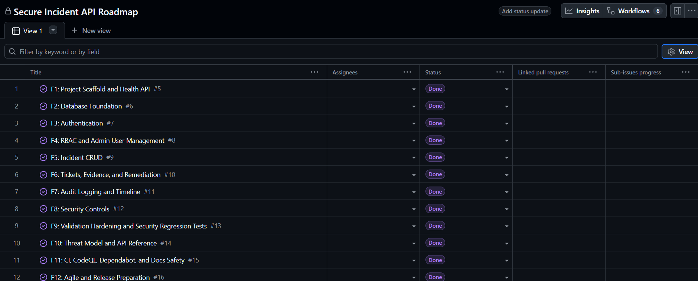
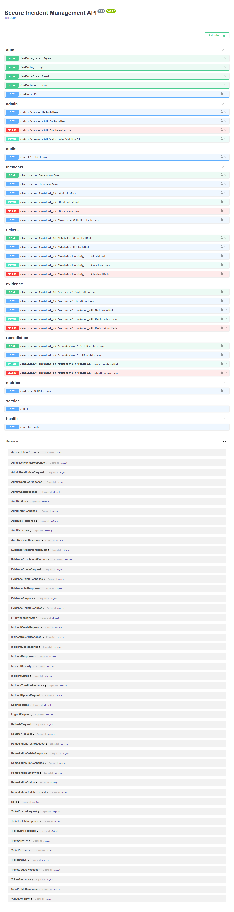
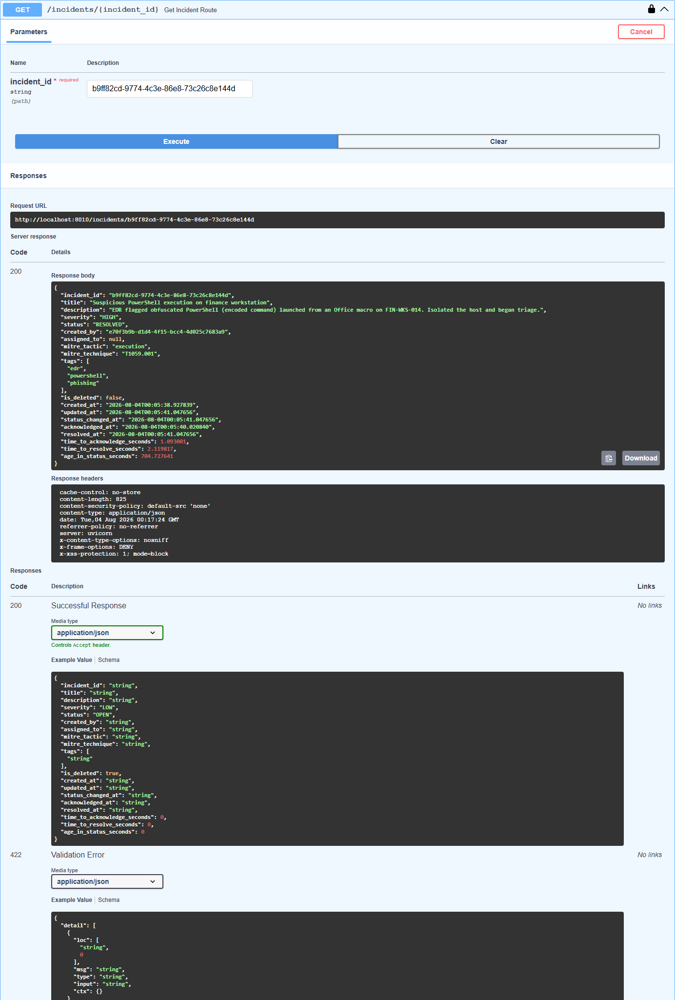
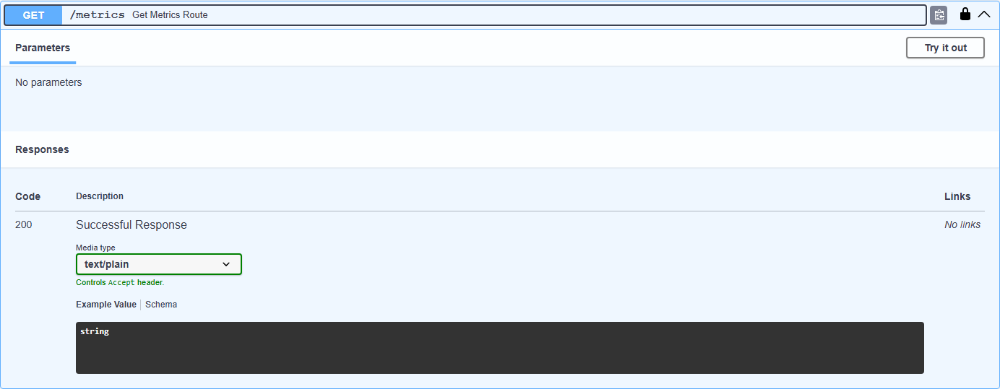

# Secure Incident Management API

[](https://github.com/SeifMoussa/secure-incident-api-lab/actions/workflows/ci.yml)
[](https://github.com/SeifMoussa/secure-incident-api-lab/actions/workflows/codeql.yml)

Production-pattern FastAPI backend for defensive security incident management.

This is a defensive portfolio lab, not a deployed production SOC platform. It uses synthetic/demo data only. Do not use real credentials, real tokens, real customer incident data, or real evidence files.

## Why I Built This

I built this as a concrete way to work through the backend decisions behind an incident-management API, rather than stopping at CRUD endpoints. FastAPI kept the HTTP layer small enough that I could focus on role permissions, incident state, audit logging, and the boundary between operational data and sensitive evidence. The GitHub Issues F1-F14 and Project board are the record of how I broke that work down; they are not a claim that the lab is a finished SOC product.

## What Was Harder Than Expected

RBAC was more involved than adding a role check to each route. Role changes and user deactivation need to affect existing sessions. Ownership rules differ across evidence and incident actions, and audit readers have different permissions from incident writers. Keeping middleware audit logs useful while excluding tokens and secret-looking values also took careful tests. Alembic migrations added another boundary to verify: the schema had to build from an empty database instead of only working with a developer's existing SQLite file.

## What This Demonstrates

Secure Incident Management API demonstrates backend and application-security engineering patterns for a security operations workflow:

- FastAPI application factory.
- SQLAlchemy ORM models and Alembic baseline migrations.
- JWT authentication with access and refresh tokens.
- Refresh-token JTI blocklist.
- Password hashing, password policy, and common-password rejection.
- RBAC for ADMIN, ANALYST, VIEWER, and AUDITOR roles.
- ADMIN-only user management.
- Incident CRUD, filtering, pagination, and soft delete.
- Nested tickets, evidence notes, metadata-only attachments, and remediation tasks.
- Middleware-driven audit logging and incident timeline.
- Rate limiting, security headers, CORS allowlist, and production docs toggle.
- Strict validation, mass-assignment protection, and safe validation errors.
- Incident SLA tracking (time-to-acknowledge, time-to-resolve, age-in-status) and an ADMIN/AUDITOR-gated Prometheus-style metrics endpoint.
- STRIDE threat model and API reference.
- OpenAPI export.
- Pytest coverage, Ruff lint/format checks, GitHub Actions configuration, CodeQL configuration, and Dependabot configuration.

## Target Roles

This project is designed to be relevant for:

- Backend Developer.
- Junior Security Engineer.
- SOC Automation Analyst.
- Blue Team Analyst.
- Application Security trainee.
- DevSecOps trainee.

## Feature Summary

Implemented endpoint groups:

- General: `/`, `/health`
- Authentication: `/auth/register`, `/auth/login`, `/auth/refresh`, `/auth/logout`, `/auth/me`
- Admin users: `/admin/users/`, `/admin/users/{uid}`, `/admin/users/{uid}/role`
- Incidents: `/incidents/`, `/incidents/{incident_id}`, `/incidents/{incident_id}/timeline`
- Tickets: `/incidents/{incident_id}/tickets/`
- Evidence notes: `/incidents/{incident_id}/evidence/`
- Remediation tasks: `/incidents/{incident_id}/remediation/`
- Audit reads: `/audit/`
- Metrics: `/metrics` (ADMIN/AUDITOR only)

Evidence attachments are metadata only. There is no binary upload, no file storage, and no disk file reading for evidence.

## Architecture Overview

```text
app/
  admin/          ADMIN-only user management
  audit/          audit middleware, sanitizer, schemas, read API
  auth/           registration, login, refresh, logout, JWT helpers
  common/         shared enums, pagination, dependencies, validation, errors
  evidence/       evidence notes and metadata-only attachment workflows
  incidents/      incident CRUD, timeline, and SLA calculation
  metrics/        Prometheus-style incident volume and SLA metrics
  remediation/    remediation task workflows
  security/       headers, CORS, rate limiting, middleware registration
  tickets/        ticket workflows
alembic/          baseline migration
docs/             security, API, testing, Agile, CI/CD, release docs
tests/            unit, integration, security, docs, workflow tests
```

The application uses strict Pydantic schemas at the API boundary, service-layer business rules, SQLAlchemy ORM/query-builder patterns, and local SQLite for development and tests.

## Security Model

- JWT bearer authentication protects operational endpoints.
- Refresh tokens are typed and blocklisted by JTI on logout.
- Current database user state is used for authorization so deactivation and role changes take effect.
- RBAC gates ADMIN, ANALYST, VIEWER, and AUDITOR capabilities.
- Write requests are audit-logged by middleware with sanitized metadata.
- Sensitive fields are excluded or redacted from responses, validation errors, audit logs, docs, and tests.
- CORS defaults to an explicit local allowlist and safe production empty allowlist.
- Security headers are applied to API responses.
- Rate limiting protects login and general endpoints in normal configuration.
- Production settings disable interactive API docs and reject placeholder JWT secrets.

## RBAC Matrix

| Capability | ADMIN | ANALYST | VIEWER | AUDITOR |
| --- | --- | --- | --- | --- |
| Login/refresh/logout/me | Yes | Yes | Yes | Yes |
| List/view users | Yes | No | No | No |
| Change user role | Yes | No | No | No |
| Deactivate user | Yes | No | No | No |
| Create incidents | Yes | Yes | No | No |
| Read incidents | Yes | Yes | Yes | Yes |
| Update incidents | Yes | Yes | No | No |
| Soft-delete incidents | Yes | No | No | No |
| View incident timeline | Yes | Yes | Yes | Yes |
| Create/update/delete tickets | Yes | Yes | No | No |
| Read tickets | Yes | Yes | Yes | Yes |
| Create evidence notes | Yes | Yes | No | No |
| Update evidence notes | Yes | Own only | No | No |
| Delete evidence notes | Yes | No | No | No |
| Read evidence notes | Yes | Yes | Yes | Yes |
| Create/update/delete remediation tasks | Yes | Yes | No | No |
| Read remediation tasks | Yes | Yes | Yes | Yes |
| Read audit logs | Yes | No | No | Yes |
| Read metrics | Yes | No | No | Yes |

## Audit Logging

Audit logging is middleware-driven for write requests. It records safe metadata such as actor, action, resource type, resource ID, timestamp, client host where available, outcome, and sanitized change summaries.

Audit logs never intentionally store passwords, password hashes, access tokens, refresh tokens, authorization headers, API keys, JWT secrets, cookies, raw tokens, or secret-looking values. Audit read access is ADMIN/AUDITOR only. No audit mutation routes exist.

## Local Setup

```bash
python -m venv .venv
.venv\Scripts\activate
python -m pip install --upgrade pip
python -m pip install -e ".[dev]"
```

Use placeholder-only local settings. Do not put real secrets in `.env`.

```bash
copy .env.example .env
```

## Local Quality Commands

```bash
python scripts/export_openapi.py
python scripts/check-docs.py
python -m py_compile scripts/export_openapi.py scripts/check-docs.py
python -m pytest
python -m pytest --cov=app --cov-report=term-missing --cov-fail-under=95
python -m ruff check .
python -m ruff format --check .
python -m uvicorn app.main:create_app --factory --help
python -m alembic upgrade head
python -m alembic current
```

## Current Quality Status

Latest validation:

- Tests: 245 passed (the previously documented baseline was 244).
- Coverage: 95.6%.
- Coverage gate: 95%.
- Ruff: passed.
- Format check: passed.
- Docs safety: passed.
- OpenAPI export: passed.
- Alembic SQLite upgrade/current: passed.

The repository is published publicly at `https://github.com/SeifMoussa/secure-incident-api-lab`. CI and CodeQL are green on GitHub, with zero open code-scanning alerts and zero open secret-scanning alerts.

I tracked the build through GitHub Issues F1-F14 and closed each item as its related feature, test, or documentation task was completed. F1-F13 are closed as completed, and F14 is closed after screenshot verification. [GitHub Project #1](https://github.com/users/SeifMoussa/projects/1) shows the backlog and completion flow, with a verified board screenshot below. The annotated `v0.1.0` tag and GitHub Release are published. Dependabot major-version pull requests are reviewed individually rather than merged blindly when they cross compatibility boundaries.



## Screenshots

All screenshots below are captured from the actual running app (interactive API docs at `/docs`), using seeded synthetic demo incidents. No fake or mocked screenshots are included.

<p align="center">
  
</p>

*The full interactive API surface — auth, admin, incidents, tickets, evidence, remediation, audit, and the metrics endpoint from this session's work.*

<p align="center">
  
</p>

*A real incident response with SLA tracking fully populated — `status_changed_at`, `acknowledged_at`, `resolved_at`, and the derived `time_to_acknowledge_seconds`, `time_to_resolve_seconds`, and `age_in_status_seconds` fields, all computed from the actual status-transition history.*

<p align="center">
  
</p>

*The `/metrics` endpoint, gated to ADMIN/AUDITOR roles, returning Prometheus text-exposition format.*

Real output from an authenticated request:

```bash
curl -s -X POST http://127.0.0.1:8010/auth/login \
  -H "Content-Type: application/json" \
  -d '{"email":"<USER_EMAIL>","password":"<PASSWORD_PLACEHOLDER>"}'
# Response includes: {"access_token": "<ACCESS_TOKEN>", ...}

curl -s http://127.0.0.1:8010/metrics -H "Authorization: Bearer <ACCESS_TOKEN>"
```

```text
# HELP incidents_by_status_total Current non-deleted incidents by status.
# TYPE incidents_by_status_total gauge
incidents_by_status_total{status="OPEN"} 1
incidents_by_status_total{status="IN_PROGRESS"} 1
incidents_by_status_total{status="CONTAINED"} 0
incidents_by_status_total{status="RESOLVED"} 1
incidents_by_status_total{status="CLOSED"} 0
# HELP incidents_by_severity_total Current non-deleted incidents by severity.
# TYPE incidents_by_severity_total gauge
incidents_by_severity_total{severity="LOW"} 0
incidents_by_severity_total{severity="MEDIUM"} 1
incidents_by_severity_total{severity="HIGH"} 1
incidents_by_severity_total{severity="CRITICAL"} 1
# HELP incident_sla_acknowledged_total Incidents that have been acknowledged.
# TYPE incident_sla_acknowledged_total gauge
incident_sla_acknowledged_total 2
# HELP incident_sla_resolved_total Incidents currently resolved or closed.
# TYPE incident_sla_resolved_total gauge
incident_sla_resolved_total 1
# HELP incident_sla_time_to_acknowledge_seconds_avg Average seconds from creation to first acknowledgement.
# TYPE incident_sla_time_to_acknowledge_seconds_avg gauge
incident_sla_time_to_acknowledge_seconds_avg 1.6061695
# HELP incident_sla_time_to_resolve_seconds_avg Average seconds from creation to resolution.
# TYPE incident_sla_time_to_resolve_seconds_avg gauge
incident_sla_time_to_resolve_seconds_avg 2.119817
# HELP incident_sla_breaching_acknowledgement_total Unacknowledged incidents older than the illustrative acknowledgement threshold.
# TYPE incident_sla_breaching_acknowledgement_total gauge
incident_sla_breaching_acknowledgement_total 0
# HELP incident_sla_breaching_resolution_total Unresolved incidents older than the illustrative resolution threshold.
# TYPE incident_sla_breaching_resolution_total gauge
incident_sla_breaching_resolution_total 0
```

## Documentation

- [STRIDE threat model](docs/threat_model.md)
- [API reference](docs/api_reference.md)
- [OpenAPI JSON](docs/openapi.json)
- [CI/CD configuration](docs/ci-cd.md)
- [Release checklist](docs/release-checklist.md)
- [Agile planning docs](docs/agile/README.md)
- [Security scope](docs/security-scope.md)
- [Testing plan](docs/testing-plan.md)

## Known Limitations

- This is a portfolio lab, not a deployed production SOC platform.
- All incidents, users, evidence notes, and attachments are synthetic demo data within the lab scope.
- There is no full enterprise SSO integration; authentication is the API's local JWT-based implementation.
- There is no live SIEM, alert-ingestion, or case-orchestration integration yet.
- No real production deployment, monitoring, backup, disaster recovery, or compliance review is included.
- Local SQLite is used for development and tests.
- In-memory rate limiting is not distributed.
- Audit logs are append-only through the API, but no external immutable audit store is implemented.

## What I Would Improve Next

I would add an external identity-provider path, then connect incident creation and status changes to a small SIEM adapter so the integration boundaries are exercised rather than hypothetical. I would also move rate limiting and audit retention to shared services before considering multi-instance deployment. Future work belongs in GitHub Issues and the Project board. Dependabot major-version PRs will stay separate and receive compatibility review rather than being merged automatically just to clear the queue.

## How to Verify It Works

Install the development dependencies, then run the repository's checks:

```bash
python -m pip install -e ".[dev]"
python scripts/export_openapi.py
python scripts/check-docs.py
python -m pytest
python -m pytest --cov=app --cov-report=term-missing --cov-fail-under=95
python -m ruff check .
python -m ruff format --check .
python -m alembic upgrade head
python -m alembic current
```

The earlier documented baseline was 244 passing tests; the current verification run collects 245 and reports 95.6% coverage. Those numbers describe this repository's test run; they do not establish production readiness.

## License

MIT. See [LICENSE](LICENSE).
