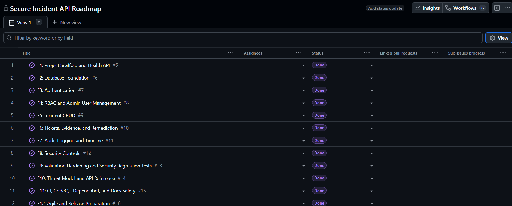

# Agile Planning Materials

These Agile materials are the source for the Secure Incident Management API portfolio backlog. The repository is published publicly, and live F1-F14 GitHub Issues were created. [GitHub Project #1](https://github.com/users/SeifMoussa/projects/1) contains all 14 issues: F1-F13 are closed and `Done`; F14 is closed and `Done` after its real screenshot was verified. Dependabot PRs #1-#4 remain open and unmerged.

The project remains defensive-only and uses synthetic/demo data only. Do not add real credentials, real tokens, real customer incident data, or real evidence files. Evidence attachments remain metadata only, with no binary upload, file storage, or disk file reading.

## Planned Board Columns

- Backlog
- In Progress
- Review
- Done

## Live Labels

- auth
- rbac
- incident
- ticket
- evidence
- remediation
- audit
- security
- validation
- test
- docs
- ci
- release

## Local Artifacts

- `docs/agile/backlog.md`: source content for the live F1-F14 Issues.
- `docs/agile/board-plan.md`: completed project-board setup record and confirmed scope limitation.
- `docs/agile/board_sprint1.png`: real screenshot of the live Project board.
- `.github/ISSUE_TEMPLATE/feature.md`: issue template for future feature work.

## Project Board Screenshot

The real board screenshot exists at `docs/agile/board_sprint1.png`. No fake screenshot is included in this repository.
